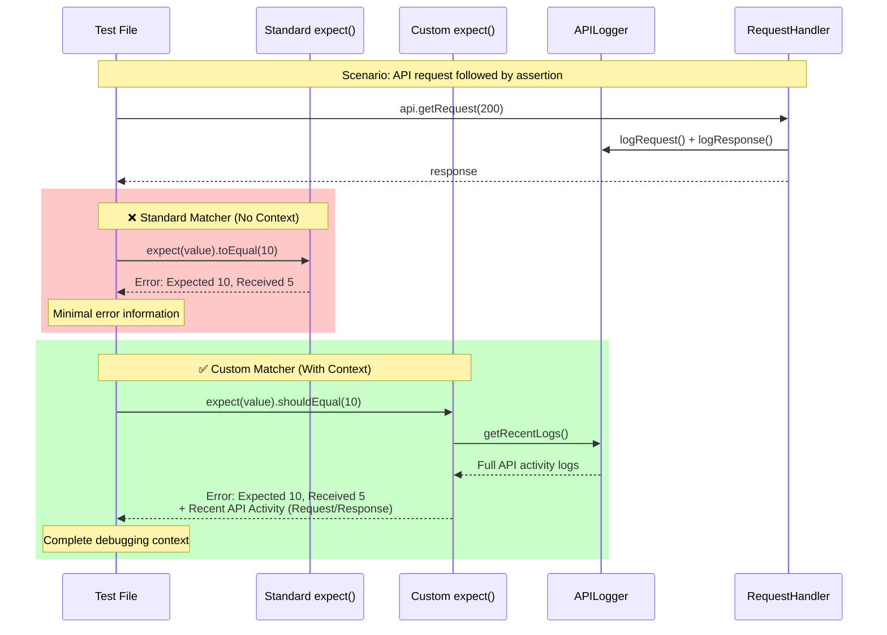
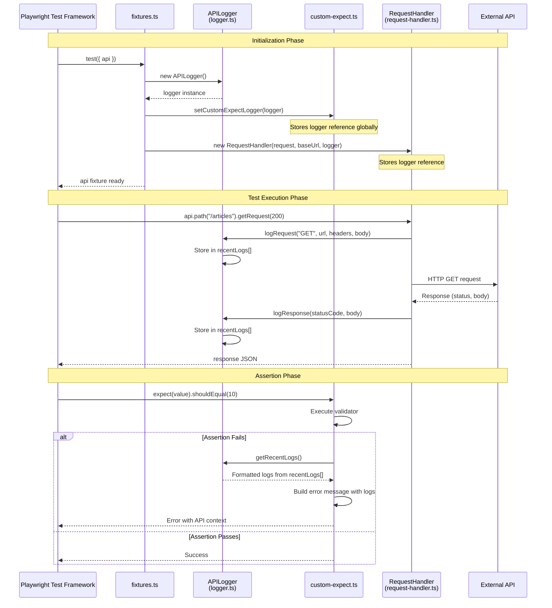
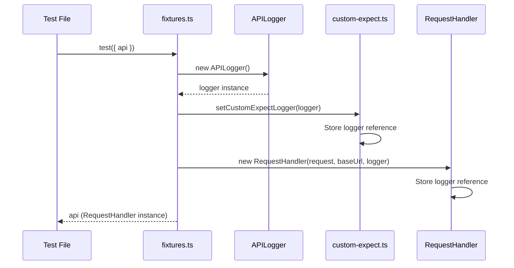
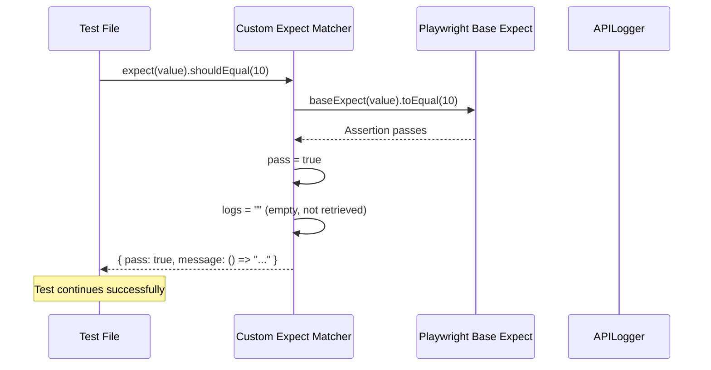
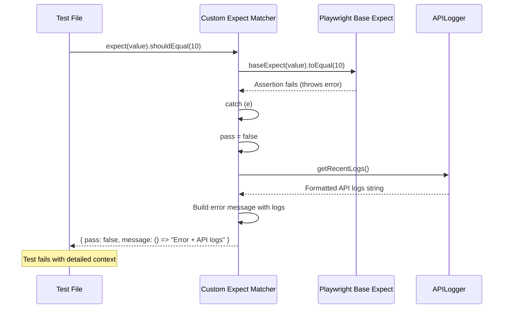
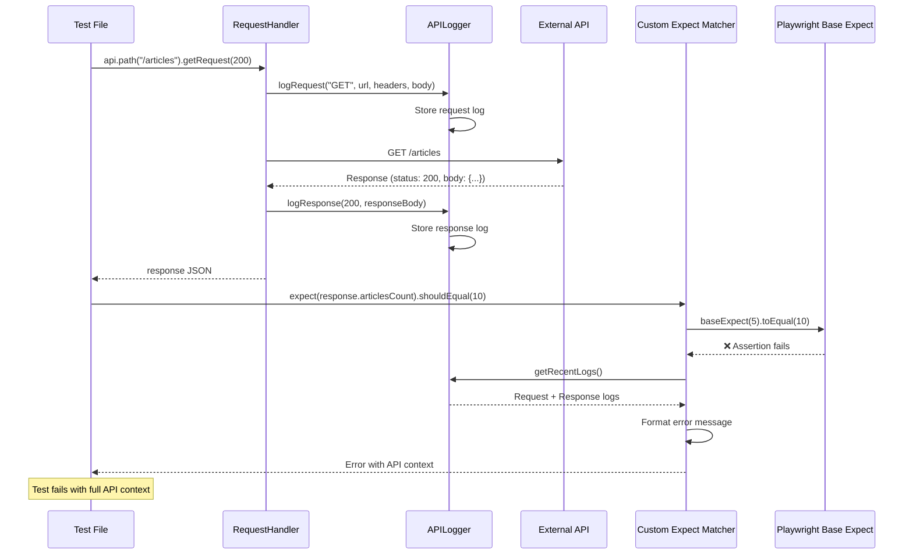
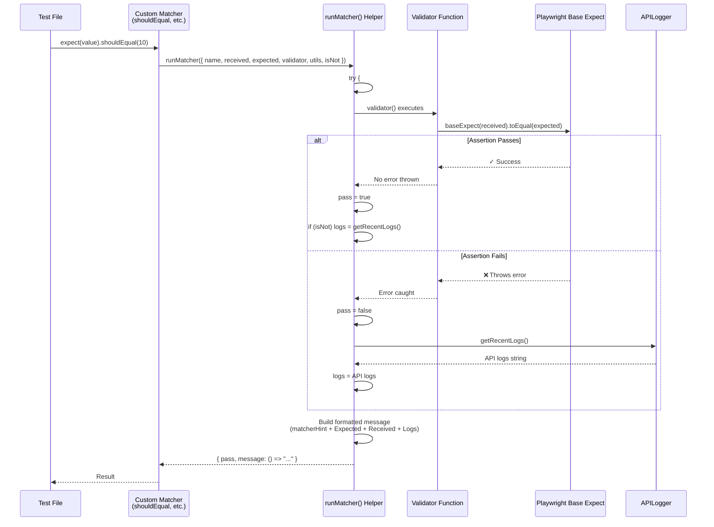

# Custom Expect Matchers: Deep Dive

## Table of Contents
- [Why `custom-expect.ts` is Needed](#why-custom-expectts-is-needed)
- [Goals and Objectives](#goals-and-objectives)
- [Problems It Solves](#problems-it-solves)
  - [Comparison: Standard vs Custom Matchers](#comparison-standard-vs-custom-matchers)
- [Current Implementation](#current-implementation)
  - [Component Interaction Diagram](#component-interaction-diagram)
  - [System Initialization Sequence](#system-initialization-sequence)
  - [Assertion Success Flow](#assertion-success-flow)
  - [Assertion Failure Flow](#assertion-failure-flow)
  - [Complete Test Flow with API Request and Assertion](#complete-test-flow-with-api-request-and-assertion)
- [How to Improve and Generalize](#how-to-improve-and-generalize)
  - [Generic Helper Flow](#generic-helper-flow)
- [Advanced Improvements](#advanced-improvements)

---

## Why `custom-expect.ts` is Needed

### The Context Problem in API Testing

When writing API tests with Playwright, assertion failures often occur without sufficient context about what happened during the test execution. Consider this scenario:

```typescript
test("Get Articles", async ({ api }) => {
  const response = await api.path("/articles").getRequest(200);
  expect(response.articlesCount).toEqual(10); // ❌ Fails!
});
```

**The Problem:** When `expect(response.articlesCount).toEqual(10)` fails, you only see:
```
Expected: 10
Received: 5
```

You have **no information** about:
- What API request was made before this assertion
- What response was received
- The sequence of API calls leading to the failure
- Request headers, body, or response details

This makes debugging extremely difficult, especially in complex test scenarios with multiple API calls.

### The Solution: Custom Matchers with Integrated Logging

The `custom-expect.ts` file extends Playwright's `expect` API to create custom matchers that automatically include API activity logs when assertions fail. This provides comprehensive debugging context without requiring manual logging in every test.

---

## Goals and Objectives

### Primary Goals

1. **Enhanced Debugging Experience**
   - Automatically include API logs in assertion error messages
   - Provide full context about request/response details when tests fail
   - Reduce debugging time by eliminating the need to manually add logging

2. **Seamless Integration**
   - Work seamlessly with Playwright's existing `expect` API
   - Support both positive and negative assertions (`expect().not.shouldEqual()`)
   - Maintain compatibility with Playwright's test framework

3. **Type Safety**
   - Provide TypeScript type definitions for IDE autocomplete
   - Ensure type safety for matcher parameters
   - Enable proper IntelliSense support

4. **Extensibility**
   - Easy to add new custom matchers
   - Reusable pattern for creating additional assertion methods
   - Maintainable and scalable architecture

### Secondary Objectives

- **Consistency**: All custom matchers follow the same pattern
- **Performance**: Minimal overhead when assertions pass
- **Flexibility**: Support various assertion types (equality, comparison, containment, etc.)

---

## Problems It Solves

### Comparison: Standard vs Custom Matchers

The following diagram compares the flow when an assertion fails using standard Playwright matchers versus custom matchers:



### Problem 1: Lack of Context in Failed Assertions

**Before:**
```typescript
test("Get Articles", async ({ api }) => {
  const response = await api.path("/articles").getRequest(200);
  expect(response.articlesCount).toEqual(10); // Fails with minimal info
});
```

**Error Output:**
```
Expected: 10
Received: 5
```

**After:**
```typescript
test("Get Articles", async ({ api }) => {
  const response = await api.path("/articles").getRequest(200);
  expect(response.articlesCount).shouldEqual(10); // Includes API logs
});
```

**Error Output:**
```
Expected: 10
Received: 5
Recent API Activity:
===Request Details===
{
  "method": "GET",
  "url": "https://conduit-api.bondaracademy.com/api/articles",
  "headers": {},
  "body": {}
}

===Response Details===
{
  "statusCode": 200,
  "body": {
    "articles": [...],
    "articlesCount": 5
  }
}
```

### Problem 2: Manual Logging Overhead

**Without Custom Matchers:**
```typescript
test("Complex Test", async ({ api }) => {
  const response1 = await api.path("/articles").getRequest(200);
  console.log("Response 1:", response1); // Manual logging
  
  const response2 = await api.path("/tags").getRequest(200);
  console.log("Response 2:", response2); // Manual logging
  
  expect(response1.articlesCount).toEqual(10); // No context if fails
  expect(response2.tags.length).toBeGreaterThan(5); // No context if fails
});
```

**With Custom Matchers:**
```typescript
test("Complex Test", async ({ api }) => {
  const response1 = await api.path("/articles").getRequest(200);
  const response2 = await api.path("/tags").getRequest(200);
  
  expect(response1.articlesCount).shouldEqual(10); // Auto-includes logs
  expect(response2.tags.length).shouldBeGreaterThan(5); // Auto-includes logs
});
```

### Problem 3: Inconsistent Error Messages

Standard Playwright matchers don't integrate with the `APILogger`, leading to inconsistent error reporting across the test suite. Custom matchers ensure all assertion failures include consistent, detailed API context.

---

## Current Implementation

### Architecture Overview

The `custom-expect.ts` file works in conjunction with three other utility modules:

1. **`logger.ts`**: Captures and stores API request/response details
2. **`request-handler.ts`**: Makes API calls and logs them using `APILogger`
3. **`fixtures.ts`**: Sets up the logger and connects it to custom expect

#### Component Interaction Diagram

The following diagram shows how all components interact in the system:



**Key Relationships:**
- **Fixture** creates and wires together all components
- **RequestHandler** logs all API requests/responses via **APILogger**
- **CustomExpect** retrieves logs from **APILogger** when assertions fail
- All components share the same **APILogger** instance for consistency

### Current Code Structure

```12:70:utils/custom-expect.ts
import { expect as baseExpect } from "@playwright/test";
import { APILogger } from "./logger";

let apiLogger: APILogger;

export const setCustomExpectLogger = (logger: APILogger) => {
  apiLogger = logger;
};

declare global {
  namespace PlaywrightTest {
    interface Matchers<R, T> {
      shouldEqual(expcted: T): R;
      shouldBeLessThanOrEqual(expcted: T): R;
    }
  }
}

export const expect = baseExpect.extend({
  shouldEqual(received: any, expected: any) {
    let pass: boolean;
    let logs: string = "";
    try {
      baseExpect(received).toEqual(expected);
      pass = true;
      if (this.isNot) logs = apiLogger.getRecentLogs();
    } catch (e: any) {
      pass = false;
      logs = apiLogger.getRecentLogs();
    }

    const hint = this.isNot ? "not" : "";
    const message =
      this.utils.matcherHint("shouldEqual", undefined, undefined, { isNot: this.isNot }) +
      "\n\n" +
      `Expected: ${hint} ${this.utils.printExpected(expected)}\n` +
      `Received: ${this.utils.printReceived(received)}\n` +
      `Recent API Activity: \n${logs}`;

    return {
      message: () => message,
      pass,
    };
  },
  shouldBeLessThanOrEqual(received: any, expected: any) {
    let pass: boolean;
    let logs: string = "";
    try {
      baseExpect(received).toEqual(expected);
      pass = true;
      if (this.isNot) logs = apiLogger.getRecentLogs();
    } catch (e: any) {
      pass = false;
      logs = apiLogger.getRecentLogs();
    }

    const hint = this.isNot ? "not" : "";
    const message =
      this.utils.matcherHint("shouldBeLessThanOrEqual", undefined, undefined, { isNot: this.isNot }) +
      "\n\n" +
      `Expected: ${hint} ${this.utils.printExpected(expected)}\n` +
      `Received: ${this.utils.printReceived(received)}\n` +
      `Recent API Activity: \n${logs}`;

    return {
      message: () => message,
      pass,
    };
  },
});
```

### How It Works

1. **Initialization**: The `setCustomExpectLogger()` function stores a reference to the `APILogger` instance
2. **Logger Setup**: The fixture (`fixtures.ts`) creates an `APILogger` and passes it to both `RequestHandler` and `setCustomExpectLogger()`
3. **Request Logging**: When API requests are made via `RequestHandler`, they're automatically logged
4. **Assertion Failure**: When a custom matcher fails, it retrieves recent API logs and includes them in the error message

#### System Initialization Sequence

The following diagram shows how the system initializes when a test starts:



#### Assertion Success Flow

When an assertion passes, the flow is straightforward:



#### Assertion Failure Flow

When an assertion fails, the custom matcher retrieves API logs:



#### Complete Test Flow with API Request and Assertion

This diagram shows the complete flow from API request to assertion:



### Integration Flow

```typescript
// fixtures.ts
const logger = new APILogger();
setCustomExpectLogger(logger); // Connects logger to custom expect
const requestHandler = new RequestHandler(request, baseUrl, logger);

// request-handler.ts
this.logger.logRequest("GET", url, headers, body); // Logs request
const response = await this.request.get(url, { headers });
this.logger.logResponse(statusCode, responseJSON); // Logs response

// custom-expect.ts
logs = apiLogger.getRecentLogs(); // Retrieves logs when assertion fails
```

---

## How to Improve and Generalize

### Current Limitations

1. **Code Duplication**: Each matcher repeats the same try/catch, logging, and message formatting logic
2. **Limited Matchers**: Only two matchers are implemented (`shouldEqual`, `shouldBeLessThanOrEqual`)
3. **Bug in `shouldBeLessThanOrEqual`**: Uses `toEqual` instead of `toBeLessThanOrEqual` (line 49)
4. **Manual Type Declarations**: TypeScript types must be manually added for each matcher
5. **No Extensibility Pattern**: Adding new matchers requires copying and modifying existing code

### Solution: Generic Helper Function

The recommended approach is to create a **generic `runMatcher()` helper function** that encapsulates all the repetitive logic. This makes adding new matchers trivial and eliminates code duplication.

#### Generic Helper Flow

The following diagram illustrates how the `runMatcher()` helper simplifies the matcher implementation:



**Key Benefits:**
- All matchers use the same `runMatcher()` helper
- Consistent error formatting across all matchers
- Easy to add new matchers (just pass different validator function)
- Centralized logging and error handling logic

#### Improved Implementation

```typescript
import { expect as baseExpect } from "@playwright/test";
import { APILogger } from "./logger";

let apiLogger: APILogger;

export const setCustomExpectLogger = (logger: APILogger) => {
  apiLogger = logger;
};

// Generic helper for all matchers
function runMatcher({
  name,
  received,
  expected,
  validator,
  utils,
  isNot,
}: {
  name: string;
  received: any;
  expected: any;
  validator: () => void;
  utils: any;
  isNot: boolean;
}) {
  let pass = false;
  let logs = "";

  try {
    validator(); // Executes the actual assertion (e.g., baseExpect(received).toEqual(expected))
    pass = true;
    if (isNot) logs = apiLogger.getRecentLogs();
  } catch (e) {
    pass = false;
    logs = apiLogger.getRecentLogs();
  }

  const hint = isNot ? "not" : "";

  const message =
    utils.matcherHint(name, undefined, undefined, { isNot }) +
    "\n\n" +
    `Expected: ${hint} ${utils.printExpected(expected)}\n` +
    `Received: ${utils.printReceived(received)}\n` +
    `Recent API Activity:\n${logs}`;

  return {
    pass,
    message: () => message,
  };
}

export const expect = baseExpect.extend({
  shouldEqual(received: any, expected: any) {
    return runMatcher({
      name: "shouldEqual",
      received,
      expected,
      validator: () => baseExpect(received).toEqual(expected),
      utils: this.utils,
      isNot: this.isNot,
    });
  },

  shouldBeLessThanOrEqual(received: any, expected: any) {
    return runMatcher({
      name: "shouldBeLessThanOrEqual",
      received,
      expected,
      validator: () => baseExpect(received).toBeLessThanOrEqual(expected), // Fixed: was using toEqual
      utils: this.utils,
      isNot: this.isNot,
    });
  },

  // Adding new matchers is now trivial:
  
  shouldBeGreaterThan(received: any, expected: number) {
    return runMatcher({
      name: "shouldBeGreaterThan",
      received,
      expected,
      validator: () => baseExpect(received).toBeGreaterThan(expected),
      utils: this.utils,
      isNot: this.isNot,
    });
  },

  shouldContain(received: any[], expected: any) {
    return runMatcher({
      name: "shouldContain",
      received,
      expected,
      validator: () => baseExpect(received).toContain(expected),
      utils: this.utils,
      isNot: this.isNot,
    });
  },

  shouldStartWith(received: string, expected: string) {
    return runMatcher({
      name: "shouldStartWith",
      received,
      expected,
      validator: () => baseExpect(received.startsWith(expected)).toBe(true),
      utils: this.utils,
      isNot: this.isNot,
    });
  },
});
```

### Benefits of the Generic Approach

#### ✅ **Eliminates Code Duplication**

**Before:** Each matcher had ~30 lines of repeated code
**After:** Each matcher is only 4-5 lines

#### ✅ **Easy to Add New Matchers**

Adding a new matcher like `shouldBeTrue()`:

```typescript
shouldBeTrue(received: boolean) {
  return runMatcher({
    name: "shouldBeTrue",
    received,
    expected: true,
    validator: () => baseExpect(received).toBe(true),
    utils: this.utils,
    isNot: this.isNot,
  });
}
```

#### ✅ **Centralized Logic**

All the repetitive logic is in one place:
- Try/catch handling
- Log retrieval
- Pass/fail calculation
- Message formatting
- `isNot` handling
- Expected/received printing
- Matcher hint rendering

#### ✅ **Consistent Behavior**

All matchers behave identically, reducing bugs and inconsistencies.

#### ✅ **Maintainable**

Changes to logging or error formatting only need to be made in one place.

---

## Advanced Improvements

### 1. Automatic TypeScript Type Declarations

To avoid manually declaring types for each matcher, create a separate type definition file:

#### `utils/matchers.d.ts`

```typescript
export interface CustomMatchers<R> {
  shouldEqual<T>(expected: T): R;
  shouldBeLessThanOrEqual<T>(expected: T): R;
  shouldBeGreaterThan(expected: number): R;
  shouldContain<T>(expected: T): R;
  shouldStartWith(expected: string): R;
  shouldEndWith(expected: string): R;
  shouldBeTrue(): R;
  shouldBeFalse(): R;
  // Add more matchers here as you create them
}
```

#### `utils/global.d.ts`

```typescript
import { CustomMatchers } from "./matchers";

declare global {
  namespace PlaywrightTest {
    interface Matchers<R, T> extends CustomMatchers<R> {}
  }
}

export {};
```

**Benefits:**
- Single source of truth for matcher types
- Automatic IDE autocomplete for all matchers
- Type safety without duplication
- Easy to extend: add to `CustomMatchers` interface and implement in `expect.extend()`

### 2. Matcher Builder Pattern

For even more automation, create a matcher builder:

```typescript
function createMatcher(
  name: string,
  validator: (received: any, expected: any) => void
) {
  return function(received: any, expected: any) {
    return runMatcher({
      name,
      received,
      expected,
      validator: () => validator(received, expected),
      utils: this.utils,
      isNot: this.isNot,
    });
  };
}

// Usage:
export const expect = baseExpect.extend({
  shouldEqual: createMatcher("shouldEqual", (r, e) => baseExpect(r).toEqual(e)),
  shouldBeGreaterThan: createMatcher("shouldBeGreaterThan", (r, e) => baseExpect(r).toBeGreaterThan(e)),
  // ... etc
});
```

### 3. Configurable Logging

Add options to control when logs are included:

```typescript
interface MatcherOptions {
  includeLogs?: boolean;
  logLimit?: number; // Only show last N API calls
}

function runMatcher({
  // ... existing params
  options = {},
}: {
  // ... existing params
  options?: MatcherOptions;
}) {
  const { includeLogs = true, logLimit } = options;
  
  // ... existing logic
  
  if (includeLogs) {
    let logs = apiLogger.getRecentLogs();
    if (logLimit) {
      // Filter logs to show only last N entries
    }
    message += `Recent API Activity:\n${logs}`;
  }
  
  return { pass, message: () => message };
}
```

### 4. Performance Optimization

Only retrieve logs when needed:

```typescript
function runMatcher({ ... }) {
  let pass = false;
  let logs = "";

  try {
    validator();
    pass = true;
    // Only get logs if assertion failed or isNot is true
    if (isNot) logs = apiLogger.getRecentLogs();
  } catch (e) {
    pass = false;
    logs = apiLogger.getRecentLogs(); // Only retrieve when needed
  }
  
  // ... rest of logic
}
```

### 5. Enhanced Error Messages

Add more context to error messages:

```typescript
const message =
  utils.matcherHint(name, undefined, undefined, { isNot }) +
  "\n\n" +
  `Expected: ${hint} ${utils.printExpected(expected)}\n` +
  `Received: ${utils.printReceived(received)}\n` +
  (logs ? `Recent API Activity:\n${logs}` : "") +
  `\nTest Context: ${utils.printReceived({ testName: this.test?.title })}`;
```

### 6. Unit Tests for Matchers

Create tests to ensure matchers work correctly:

```typescript
// tests/custom-expect.test.ts
import { expect } from "../utils/custom-expect";
import { APILogger } from "../utils/logger";

test("shouldEqual includes logs on failure", () => {
  const logger = new APILogger();
  logger.logRequest("GET", "/test", {}, {});
  logger.logResponse(200, { count: 5 });
  
  setCustomExpectLogger(logger);
  
  expect(() => {
    expect(5).shouldEqual(10);
  }).toThrow(/Recent API Activity/);
});
```

---

## Summary

### Why `custom-expect.ts` Exists

- **Problem**: Standard Playwright assertions lack API context when they fail
- **Solution**: Custom matchers that automatically include API logs in error messages
- **Benefit**: Faster debugging and better test failure diagnostics

### Current State

- ✅ Works correctly for basic use cases
- ✅ Integrates with `APILogger` and `RequestHandler`
- ✅ Supports positive and negative assertions
- ⚠️ Has code duplication
- ⚠️ Limited number of matchers
- ⚠️ Bug in `shouldBeLessThanOrEqual` implementation

### Recommended Improvements

1. **Implement `runMatcher()` helper** - Eliminates duplication, makes adding matchers trivial
2. **Fix `shouldBeLessThanOrEqual` bug** - Use correct assertion method
3. **Add TypeScript type definitions** - Separate file for better maintainability
4. **Add more matchers** - `shouldBeGreaterThan`, `shouldContain`, `shouldStartWith`, etc.
5. **Add unit tests** - Ensure matchers work correctly
6. **Consider builder pattern** - For even more automation (optional)

### Next Steps

1. Refactor `custom-expect.ts` to use the `runMatcher()` helper
2. Add the recommended matchers
3. Create `matchers.d.ts` and `global.d.ts` for type definitions
4. Write unit tests for custom matchers
5. Document all available matchers in README

---

## References

- [Playwright Custom Matchers Documentation](https://playwright.dev/docs/test-assertions#add-custom-matchers-using-expectextend)
- Project files:
  - `utils/custom-expect.ts` - Current implementation
  - `utils/logger.ts` - API logging system
  - `utils/request-handler.ts` - HTTP request handler
  - `utils/fixtures.ts` - Playwright fixtures setup
  - `tests/07-TestwithExpectLogger.spec.ts` - Usage examples

